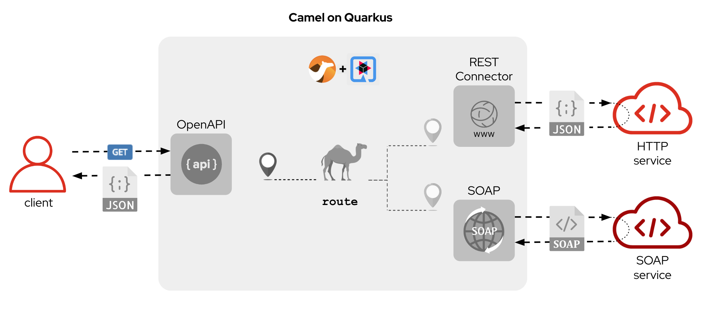

:quarkus-code-generator: link:https://code.quarkus.redhat.com/[Quarkus code generator, window="_blank", , id="rhd-source-article"]

[id='lab-intro']
= Lab Introduction

_Red Hat Fuse_ is a _Karaf_ (OSGI) based container to run _Apache Camel_ (and _Java_) applications. However, since the appearance of containers and _Kubernetes_ environments, the preferred approach to deliver services is by adopting micro-services architectures.

In this exercise you will undergo the process of migrating a _Red Hat Fuse_ service into a _Red Hat build of Apache Camel_ on _Quarkus_ application.

{empty} +

[time=1]
[id="the-service"]
== The service

For illustration purposes, the picture below shows what the _Camel_ integration end-to-end flow looks like.



The service exposes a REST (Json) entrypoint and integrates with two backends, one is REST based, and the second endpoint is SOAP based. 

The integration represents a composition service. It obtains information from both end systems and merges the data to respond to the client request.

The service currently runs on _Red Hat Fuse_ and we want to modernise it to run on _Camel Quarkus_.

{empty} +


[time=1]
[id="migrate-service"]
== Migrate the service

Both _Fuse_ and _Camel_ on _Quarkus_ are _Java_ projects based on _Maven_. Aside from packaging differences, their general structure is very similar and migrating files from one to the other is relatively easy.

NOTE: The degree of difficulty to migrate a project will obviously vary depending on the complexity and coding practices of the original source code.

Commonly, a Camel integration project involves the following resources:

- *Integration flows*: _Camel_ routes in XML/Java code
- *Java*: for custom functionality.
- *API contracts*: WSDLs/OpenAPI interfaces
- *Data mappings*: XSLTs/Java
- *Test units*: Java

NOTE: In a case by case basis, projects with different needs may additionally require other type of resources, like database schemas, SQL scripts, protocol schemas, templates, properties, etc.

The _Fuse_ project to migrate in this lab contains the common elements above described, and was implemented following best coding practices at the time available.

Nonetheless, the migration offers opportunities to improve/modernise coding practices and adopt new standards.

{empty} +

### Working on the Camel Quarkus project

You typically start a _Camel on Quarkus_ project by creating a project skeleton. The {quarkus-code-generator} is a great place where to start. You can use its search filter to automatically display all the _Apache Camel_ extensions available for _Quarkus_.

This lab however already includes a pre-generated skeleton you will use to complete the migration. It will accelerate the work and help minimise human factor mistakes during the migration exercises.

Inspect the list below for a summary of the files in the project you need to work on:

. New resources:
- *openapi.json* (REST definition using the OpenApi standard)
- *Routes.java* (Where the CXF SOAP endpoint is defined)
- *j2x.xsl* (XSLT with out-of-the-box JSON to XML transformer)
. Migrated resources:
- *api-medium.xml* (Camel XML routes)
- *request.xsl* / *response.xsl* (XSLT mappings)
- *application.properties* (configuration)
- *ServiceTest.java* (JUnit)
. Copied resources:
- *s1.wsdl* (SOAP service definition)
- *response.json* (Unit test sample)
- *response.xml*  (Unit test sample)

{empty} +

### Migrate the Blueprint XML files

The best place in a _Fuse_ project from where to start migrating code is from the Blueprint definitions.

[NOTE]
-- 
* In the sections below, we only cover the code blocks in the _Blueprint_ files we need to migrate. +
* Other blocks are discarded because they are _Karaf_-specific and not needed in _Camel Quarkus_.
--

All the _Blueprint_ definitions are located in the _Fuse_ project under the folder:

 - *src/main/resources/OSGI-INF/blueprint/*

{empty} +

#### Configuration

When looking at the first code block from the `configuration.xml` blueprint file you'll find the configuration properties needed for _Karaf_ deployments:
--
  <cm:property-placeholder persistent-id="demo.medium" id="demo.medium">
  <cm:default-properties>
      <cm:property name="rest.host" value="localhost"/>
      <cm:property name="rest.port" value="20000"/>
      <cm:property name="api.backend1.host" value="localhost:10000"/>
      <cm:property name="api.backend1.path" value="/camel/subscriber/details"/>
      <cm:property name="api.backend2.host" value="localhost:9000"/>
  </cm:default-properties>
  </cm:property-placeholder>
--

From the properties above we can discard `rest.host` and `rest.port` because they define a dedicated (private) port in a _Karaf_ container shared with other applications. In _Quarkus_ we use the default server port because the _Camel_ project fully owns the running instance (unlike _Karaf_ running multiple bundles). 

In a _Quarkus_ project, all the configuration is located in the `application.properties` file.

Open the file in your _Camel Quarkus_ project:

- *src/main/resources/application.properties*

And follow the steps indicated below:

. Find the region of code with the following declaration:
+
----
# COPY PASTE HERE ENDPOINTS CONFIGURATION
----

. Replace the line above with the following configuration:
+
```properties
# REST Backend configuration
      api.backend1.host = end1:8080
      api.backend1.path = /camel/subscriber/details
# JUnits and Local testing configuration
 %dev.api.backend1.host = localhost:10000
%test.api.backend1.path = /unit/test/subscriber/details

# SOAP Backend configuration
      api.backend2.host = end2:8080
# JUnits and Local testing configuration
 %dev.api.backend2.host = localhost:9000
%test.api.backend2.host = localhost:{{quarkus.http.test-port}}

# Quarkus test port randomly allocated
quarkus.http.test-port=0
```

NOTE: You'll notice the last line defines `quarkus.http.test-port=0` which indicates to _Quarkus_ to randomly allocate the port to use as the system's entrypoint. We'll discuss this point later in the lab during unit testing. 

[NOTE]
--
In _Quarkus_ you can easily define values for different environments by simply using environment prefixes:

- The `%dev.` prefix defines values when running in developer mode.
- The `%test.` prefix defines values when running Junits (test mode).
--

{empty} +

#### SOAP endpoint (CXF definition)

The next relevant block from the `cxf.xml` blueprint file (in _Fuse_) is the CXF endpoint definition, as shown below:
--
  <camelcxf:cxfEndpoint 
     id="s1"
     address="http://${api.backend2.host}/services/s1"
     serviceClass="org.example.s1.S1">
    <camelcxf:properties>
      <entry key="dataFormat" value="PAYLOAD"/>
    </camelcxf:properties>
  </camelcxf:cxfEndpoint>
--

In _Camel Quarkus_ projects you can also define _CXF_ endpoints in XML, but using Bean XML definitions instead of _Blueprint_ constructs.

The equivalent XML bean for _Camel_ is shown below. Copy the properties from the snippet below and paste them in the _Camel_ XML resource in your _Camel Quarkus_ project.

Open the following file in your _Camel Quarkus_ project:

- *src/main/resources/routes/api-medium.xml*

And follow the instructions below:

. Find the region of code with the following declaration:
+
----
    <!-- SOAP Endpoint -->
    <bean name="s1" type="org.apache.camel.component.cxf.jaxws.CxfEndpoint">

      <!-- COPY/PASTE PROPERTIES HERE -->

    </bean>
----

. Replace the line `COPY/PASTE PROPERTIES HERE` with:
+
```xml
      <properties>
        <property key="serviceClass" value="org.example.s1.S1" />
        <property key="address" value="/s1" />
        <property key="dataFormat" value="PAYLOAD" />
      </properties>
```

Your CXF (SOAP) endpoint is now defined in your migrated code.

{empty} +

#### API exposure (REST entrypoint)

The next relevant block from the `camel.xml` blueprint file is the REST DSL code that defines the API operation to invoke the service, as shown below:
--
  	<restConfiguration 
  		component="netty-http"
  		host="{{rest.host}}" 
  		port="{{rest.port}}" 
  		enableCORS="true">
  	</restConfiguration>

    <rest path="/camel">
        <post consumes="application/json" id="getDetails" uri="/subscriber/details" produces="application/json">
            <param name="body" required="true" type="body"/>
            <to uri="direct:getDetails"/>
        </post>
    </rest>
--

* The `<restConfiguration>` code defines the _Camel_ component used and configurable parameters.
* The `<rest>` block defines a `<post>` operation to invoke the service. 

Although this is valid code in the latest _Camel_ version and still runnable on _Camel Quarkus_, it follows a code-first approach which is discouraged in nowadays enterprise solutions.

For the migrated service in _Quarkus_, we discard the code blocks above and define instead an _OpenApi_ contract equivalent to the POST operation and data exchange. The _OpenApi_ represents the source of truth and allows us to adopt an API-first approach (also known as contract-first).

In your _Quarkus_ project you'll find the _OpenApi_ definition under the following location:

- *src/main/resources/META-INF/openapi.json*

NOTE: The _OpenApi_ definition provided was created with _Apicurio Studio_, a beautiful and intuitive design-time visual tool.

Instead of manually creating the REST DSL definition (code-first) we automate its generation out of the _OpenApi_ (contract-first). This automation simplifies the work by letting the developer just focus on the processing flow implementation, as illustrated in the figure below:


The auto-generated code automation shown above is enabled via the configuration of a _Maven_ plugin.

Follow the steps below to configure the plugin:

--
. Open your `pom.xml` file and find the following region in the code:
+
----
<plugins>
    ...
    <!-- COPY HERE YOUR MAVEN PLUGIN TO GENERATE THE OPENAPI -->
</plugins>
----
+
. Copy and paste the Maven plugin below in your POM file:

```xml
      <!-- 
      To enable API-first approach:
      This plugin auto-generates the Camel REST-DSL definition
      Camel loads it from the classpath -->
      <plugin>
        <groupId>org.apache.camel</groupId>
        <artifactId>camel-restdsl-openapi-plugin</artifactId>
        <version>4.1.0</version>
        <executions>
            <execution>
                <id>generate-rest-dsl</id>
                <phase>generate-sources</phase>
                <goals>
                    <goal>generate-xml</goal>
                </goals>
                <configuration>
                    <specificationUri>src/main/resources/META-INF/openapi.json</specificationUri>
                    <restConfiguration>false</restConfiguration>
                    <outputDirectory>${project.build.directory}/classes/routes/</outputDirectory>
                </configuration>
            </execution>
        </executions>
      </plugin>
```
--

{empty} +

#### Main Camel route

Let's migrate the main _Camel_ route that contains the end-to-end flow.

Open in _Camel Quarkus_ the file containing the _Camel_ definitions, located at:

- *src/main/resources/routes/api-medium.xml*
+
NOTE: The file is a skeleton with empty route definitions and dummy values. You will complete its definition in stages as you make progress along the lab. 

Find and replace your current definition (empty) in your Camel Project:
----
    <route id="main">
      <!-- COPY/PASTE DEFINITION HERE -->
    </route>
----

Replace the line `<!-- COPY/PASTE DEFINITION HERE -->` with the snippet below (based on the orginal _Blueprint_ definition):

```xml
      <from uri="direct:getDetails"/>

      <convertBodyTo type="String"/>

      <!-- PRESERVE ORIGINAL REQUEST PAYLOAD -->
      <setProperty name="request">           <!-- 1 -->   
        <simple>${body}</simple>
      </setProperty>

      <!-- RESOLVE BACKEND CALLS -->
      <to uri="direct:call-system1"/>
      <to uri="direct:call-system2"/>

      <!-- TRANSFORM (COMPOSE) 2 XML RESPONSES INTO JSON -->
      <to uri="direct:mapResponse"/>

      <setHeader name="content-type">        <!-- 2 -->
        <constant>application/json</constant>
      </setHeader>
```

.Click here for reveal the migrations differences.
[%collapsible]
======
In the snippet above the following migration changes have been applied to the original _Blueprint_ code (everything else has been left as-is).

<1> The old attribute `propertyName` is now `name`
<2> The old attribute `headerName` is now `name`.
======

.Click here for reveal the original _Blueprint_ definition.
[%collapsible]
======
----
<route id="main">
    <from uri="direct:getDetails"/>

    <convertBodyTo type="String"/>

    <!-- PRESERVE ORIGINAL REQUEST PAYLOAD -->
    <setProperty propertyName="request">
    <simple>${body}</simple>
    </setProperty>

    <!-- RESOLVE BACKEND CALLS -->
    <to uri="direct:call-system1"/>
    <to uri="direct:call-system2"/>

    <!-- TRANSFORM (COMPOSE) 2 XML RESPONSES INTO JSON -->
    <to uri="direct:mapResponse"/>

    <setHeader headerName="content-type">
    <constant>application/json</constant>
    </setHeader>
</route>
----
======

You can tell by looking at the entire _Camel_ `main` route definition that it describes very well the entire processing flow where the following key processes take place:

. *Call system 1 (REST backend)*
. *Call system 2 (SOAP backend)*
. *Map obtained data to respond*

The key processing steps above listed are well illustrated in our service diagram shown earlier:


{empty} +

You now have covered some good ground, let's make sure the work you've done so far actually works.

Run the following command from your terminal:

```bash
./mvnw clean compile quarkus:dev
```

_Quarkus_ provides an out-of-the-box browsable UI to test your APIs. You can display the _Swagger_ UI by:

 1. Entering its URL in your browser's address bar
 2. via the dev UI (Press `D`, then click the SmallRye OpenApi tile) 

To open the _Swagger_ UI by opening the URL in a browser, enter:

 - http://localhost:8080/q/camel/openapi.json

Click on the service to try, and hit the `Try it out` button, scroll down and then click `Execute`.

Or, from your running _Camel Quarkus_ terminal, press `[d]`, it will open the dev UI in your default browser. Find the SmallRye tile, and click **Swagger UI**.


If successful, you should get a dummy JSON response similar to:

----
{
  "client": {
    "fullName": "dummy",
    "addressLine1": "dummy",
    "addressLine2": "dummy",
    "...
}
----

[TIP]
--
The response you're obtaining is from a dummy sample payload _Camel_ loads from the following processing action in the `mapResponse` Camel route:
----
<to uri="language:constant:resource:classpath:/data/dummy.json"/>
----
--


{empty} +

#### Unit test overview

The code migration done so far simply enables the new _Camel Quarkus_ application to perform a minimal request/response interaction using the _OpenApi_ contract. It is still however pending to include all the business logic from our old _Fuse_ project.

The code to migrate is not trivial. It's advisable to find a good strategy forward that helps making progress with confidence. The _Fuse_ project has a robust and well implemented Junit. Let's take advantage of it and start migrating the old Junit to its new version which will help validating the migration work.

[NOTE]
--
- You may often find in other migration projects that unit testing is missing or not provided. Often unit testing is not embedded within the project and belongs to other organisational groups (i.e. testing teams).
- In such situations, it is most recommended to include in the scope of the migration process the creation of Junit testing to improve the overall quality of the code and, thinking medium and long term, guarantee minimal maintenance costs.
--

Let's look at the unit test included in the _Fuse_ project and understand how effective the _Camel_ testing framework is to help us validate our implementation.

The diagram below illustrates the strategy of the _Camel_ junit you will be migrating:


In the picture above observe the following elements:

- At the center you can see the main _Camel_ on _Quarkus_ project under test.
- Left (client) and right (HTTP and SOAP backends) you can see the external agents intended to interact with the system.
- The test unit diverts and simulates the interaction with clients and servers.
+
--
. It triggers the client request.
. It captures the backend traffic and validates its data
. It simulates the backend responses, both for REST and SOAP.
. It waits for the system's final response to the client.
. It validates the response and runs extra assertions.
--

In the sections that follow you will adopt a test-driven approach using the Junit described to continue migrating the _Fuse_ project.

{empty} +

#### Test-driven migration 

We intend in this section to migrate the region of code that integrates with the REST endpoint.

As hinted in the previous section, the plan is to adopt a test-driven approach, and start by migrating a portion of the _Fuse_ Junit that will help ensuring it meets the functional expectations.

The most significant difference between the original _Fuse_ Junit and the new one for _Camel Quarkus_ is the use of the _Camel_ test support class.

- For _Blueprint_ (_Fuse on Karaf_) projects you define test units as follows:
+
----
public class ServiceTest extends CamelBlueprintTestSupport {
----

- For _Camel_ on _Quarkus_ projects you declare your unit test as:
+
----
@QuarkusTest
public class ServiceTest extends CamelQuarkusTestSupport {
----


We've created a skeleton to accelerate the migration of the test unit. You only need to fill up the most relevant parts. You'll notice that the original code from _Fuse_, for the most part, is kept as-is with minor differences.


Open the following Java file from your _Camel Quarkus_ project:

- *src/test/java/org/camel/example/ServiceTest.java*

Now follow the steps described below:

Migrate from _Fuse_ the mock servers defined in the Junit as indicated.

. Find in your _Camel Quarkus_ project the region of code with the following declaration:
+
----
    @Override
    protected RouteBuilder createRouteBuilder() {
        return new RouteBuilder() {
            @Override
            public void configure() throws Exception {

                // COPY/PASTE HERE the embedded Camel routes
            }
        };
    }
----

. Include the following code where it says `COPY/PASTE HERE ...`:
+
```java
                //Quarkus random server port requires to reconfigure endpoints
                reconfigureEndpoints();  // <1>

                rest("/unit/test")
                    .post("/subscriber/details")
                    .to("direct:backend-rest");

                from("direct:backend-rest")
                    .id("backend-rest-listener")
                    .to("mock:backend-rest")
                    .to("language:constant:resource:classpath:rest/response.json");

                from("cxf:bean:s1")
                    .id("backend-soap-listener")
                    .setBody().simple("${body[0]}")
                    .to("mock:backend-soap")
                    .log("Stub got request: ${body}")
                    .to("language:constant:resource:classpath:soap/response.xml");
```


.Click here for reveal the migrations differences.
[%collapsible]
======
<1> The _RouteBuilder_ implementation is exactly the same in both versions (_Fuse_ and _Camel Quarkus_), except for the following line of code:
----
    reconfigureEndpoints();
----
NOTE: This new line is needed because the mechanism to configure test values in _Camel Quarkus_ is different than in _Karaf_. We will mention this again during the exercise.
======

.Click here for reveal the original `RouteBuilder` implementation.
[%collapsible]
======
----
    @Override
    protected RouteBuilder createRouteBuilder() {
        return new RouteBuilder() {
            @Override
            public void configure() throws Exception {

			    rest("/unit/test")
			        .post("/subscriber/details")
			        .to("direct:backend-rest");

			    from("direct:backend-rest")
                    .id("backend-rest-listener")
			        .to("mock:backend-rest")
			        .to("language:constant:resource:classpath:rest/response.json");

                from("cxf:bean:s1")
                    .id("backend-soap-listener")
                    .setBody().simple("${body[0]}")
                    .to("mock:backend-soap")
                    .log("Stub got request: ${body}")
                    .to("language:constant:resource:classpath:soap/response.xml");
            }
        };
    }
----
======


The embedded Camel routes above implement the REST and SOAP mock backends you saw earlier in the diagram:


{empty} +

You can now focus your attention on the main test unit named `testServiceGetDetails()`.

You will complete its implementation in stages. First, let's validate the processing logic sending traffic to the first endpoint (REST backend). Later you will validate also the call to the SOAP endpoint.

. Find in your _Camel Quarkus_ project the region of code with the following declaration:
+
----
    @Test
    public void testServiceGetDetails() throws Exception{

        // COPY/PASTE HERE REST checks <1>

        // COPY/PASTE HERE SOAP checks <2>

        // COPY/PASTE HERE JSON response checks <3>
    }
----
+
.Click here to reveal notes
[%collapsible]
======
<1> This is where the first block of code (below) is to be included.
<2> Leave this slot for later.
<3> Leave this slot for later.
======

. Include the following code under the lines `COPY/PASTE HERE REST checks`:
+
```java
        MockEndpoint rest = getMockEndpoint("mock:backend-rest"); 
        rest.expectedMessageCount(1);

        // COPY/PASTE HERE SOAP MOCK <1>

        //prepare new request to destination Netty endpoint
        DefaultExchange request = new DefaultExchange(context);
        request.getIn().setBody("{\"id\":\"123\"}");

        //Entrypoint address <2>
        String uri = "http://localhost:{{quarkus.http.test-port}}/camel/subscriber/details";

        //invoke service
        String jsonResponse = template.requestBody(uri, "{\"id\":\"123\"}", String.class);

        //validate stub expectations
        MockEndpoint.assertIsSatisfied(context);

        //obtain request sent to REST backend
        String restMessage = 
                rest.getExchanges().get(0).getIn().getBody(String.class);

        //validate request to REST backend
        assertEquals("{\"id\":\"123\"}", restMessage, "oh oh"); // <3>

        // COPY/PASTE HERE SOAP checks <4>
```

.Click here for reveal the migrations differences.
[%collapsible]
======
<1> Leave this slot for later. +
The SOAP backend checks will be added later in the lab.
<2> The variable `uri` is now configured with `{{quarkus.http.test-port}}` instead of `{{rest.host}}:{{rest.port}}`.
+
NOTE: We need to use the Quarkus-specific randomly allocated port.
<3> The `assertEquals` invocation is the same except, JUnit 5 defines the message argument in last position instead of first.
<4> Leave this slot for later. +
The SOAP assertions will be added later in the lab.
======

.Click here for reveal the original implementation.
[%collapsible]
======
----
	@Test
	public void testServiceGetDetails() throws Exception{

        //set Mock expectations
        MockEndpoint rest = getMockEndpoint("mock:backend-rest"); 
        rest.expectedMessageCount(1);

        //set Mock expectations
        MockEndpoint soap = getMockEndpoint("mock:backend-soap"); 
        soap.expectedMessageCount(1);

		//prepare new request to destination Netty endpoint
		DefaultExchange request = new DefaultExchange(context);
		request.getIn().setBody("{\"id\":\"123\"}");

        //Entrypoint address
		String uri = "http://{{rest.host}}:{{rest.port}}/camel/subscriber/details";

		//invoke service
		String jsonResponse = template.requestBody(uri, "{\"id\":\"123\"}", String.class);

        //validate stub expectations
        MockEndpoint.assertIsSatisfied(context);

        //obtain request sent to REST backend
        String restMessage = 
                rest.getExchanges().get(0).getIn().getBody(String.class);

        //validate request to REST backend
        assertEquals("oh oh", "{\"id\":\"123\"}", restMessage);

        ...
----
======

You have now a minimal JUnit. Run it with the command below:

```bash
./mvnw clean test
```

Not surprisingly you should see your test unit fail with the following error messages:
----
[INFO] Results:
[INFO] 
[ERROR] Failures: 
[ERROR]   ServiceTest.testServiceGetDetails:87 mock://backend-rest Received message count. Expected: <1> but was: <0>
[INFO] 
[ERROR] Tests run: 1, Failures: 1, Errors: 0, Skipped: 0
[INFO] 
[INFO] ------------------------------------------------------------------------
[INFO] BUILD FAILURE
[INFO] ------------------------------------------------------------------------
[INFO] Total time:  35.989 s
[INFO] Finished at: 2023-12-05T16:41:56Z
[INFO] ------------------------------------------------------------------------
----

The error above (`Expected: <1> but was: (0)`) is telling you the mock (REST) server never got called by _Camel_. This is only normal because you haven't migrated yet the _Camel_ route invoking the REST backend.

You can visually check, by scrolling up in your terminal, how _Camel_ printed out (log actions) dummy messages instead of performing outbound calls:
----
...
[timestamp] ... dummy call-system1 (to be removed)
[timestamp] ... dummy call-system2 (to be removed)
...
----

However, the test allows you to validate the following bullet points:

* The JUnit is successfully calling the exposed REST service `/camel/subscriber/details`
* The main route you have migrated is properly executing.
* By failing, the junit is letting you know the functionality to invoke the REST endpoint is still not complete.

{empty} +

Let's work on the code and make the Junit succeed !

{empty} +

#### REST endpoint

Let's migrate the `call-system1` _Camel_ route that contains the integration logic with the REST endpoint.

In summary, the route prepares and sends a JSON request to the backend and obtains a response that is lodged in a process variable (_Exchange_ property).

Open in _Camel Quarkus_ the file containing the _Camel_ definitions, located at:

- *src/main/resources/routes/api-medium.xml*

Find in your template the following definition (empty):
----
    <route id="call-system1">
      <from uri="direct:call-system1"/>
      <!-- COPY/PASTE DEFINITION HERE -->
      <log message="dummy call-system1 (to be removed)"/>
    </route>
----

Replace the line `<!-- COPY/PASTE DEFINITION HERE -->` with the snippet below:

```xml
      <log message="calling Backend1 with: ${body}"/>

      <!-- CALL to BACKEND -->
      <removeHeaders pattern="*"/>
      <setHeader name="content-type">                  <!-- 1 -->
        <constant>application/json</constant>
      </setHeader>
      <to id="end1" uri="http:{{api.backend1.host}}{{api.backend1.path}}"/>

      <!-- BUFFERED RESPONSE to STRING -->
      <convertBodyTo type="String"/>                   <!-- 2,3 -->

      <!-- KEEP RESPONSE -->
      <setProperty name="subscriber-response-rest">    <!-- 4 -->
        <simple>${body}</simple>
      </setProperty>

      <log message="Backend1 is: ${exchangeProperty.subscriber-response-rest}"/>
```

.Click here for reveal the migrations differences.
[%collapsible]
======
In the snippet above the following migration changes have been applied to the original _Blueprint_ code (everything else has been left as-is).

<1> The old attribute `headerName` is now `name`.
<2> The below directive is no longer needed and has been removed:
+
----
<to uri="direct:json2xml"/>
----
+
NOTE: _Camel Quarkus_ can use out-of-box JSON to XML functionality from XSLT 3.0 and XPATH 3.0.
<3> The following conversion has been added:
+
----
<convertBodyTo type="String"/>
----
+
NOTE: Converting the response to a String allows the process to read the payload multiple times (buffered responses can only be read once).

<4> The attribute `propertyName` as now `name`
======

.Click here for reveal the original Blueprint definition.
[%collapsible]
======
----
<route id="call-system1">
    <from uri="direct:call-system1"/>

    <log message="calling Backend1 with: ${body}"/>

    <!-- CALL to BACKEND -->
    <removeHeaders pattern="*"/>
    <setHeader headerName="content-type">
    <constant>application/json</constant>
    </setHeader>
    <to id="end1" uri="http:{{api.backend1.host}}{{api.backend1.path}}"/>

    <!-- CONVERT JSON to XML (to transform later) -->
    <to uri="direct:json2xml"/>

    <!-- KEEP RESPONSE -->
    <setProperty propertyName="subscriber-response-rest">
    <simple>${body}</simple>
    </setProperty>

    <log message="Backend1 is: ${exchangeProperty.subscriber-response-rest}"/>
</route>
----
======

The highlights of the _Camel_ route you just have migrated are collected in the list below:

. *Prepares and performs the call to the REST backend*.
. *Keeps the response in a process variable (Exchange property)*.

The sub-diagram shown below illustrates the implemented interaction:


{empty} +

Let's now rework the JUnit. +
As a reminder, the following line was included earlier in the lab:
----
reconfigureEndpoints();
----
NOTE: This new line was added because the mechanism to load testing configuration in _Camel Quarkus_ is different than _Karaf_ base tests.

It is time to include the necessary lines of code to reconfigure the call to point to the embedded REST server (test mock).

Edit again the test unit in your _Camel Quarkus_ project:

- *src/test/java/org/camel/example/ServiceTest.java*

And follow the steps indicated below:

. Find in your _Camel Quarkus_ project the region of code with the following declaration:
+
----
    private void reconfigureEndpoints() throws Exception {
        
        // COPY/PASTE HERE reconfiguration        
    }
----

. Include the following code where it says `COPY/PASTE HERE ...`:
+
```java
        //helper variable <1>
        String host = "http://localhost:{{quarkus.http.test-port}}";

        //reconfigure REST endpoint <2>
        AdviceWith.adviceWith(context, "call-system1", a -> {
          a.weaveById("end1").replace().to(host+"{{api.backend1.path}}");
        });

        // COPY/PASTE HERE SOAP reconfiguration <3>
```
+
.Click here to reveal notes
[%collapsible]
======
<1> The variable `host` is configured with `{{quarkus.http.test-port}}` which _Quarkus_ populates with a randomly allocated port for testing.
<2> The `AdviceWith` directive ensures the random port is used when calling the REST mock server.
<3> Leave this slot for later. +
The SOAP reconfiguration will be included in this placeholder.
======
+
.Click here to reveal the original reconfiguration code
[%collapsible]
======
The original code is _Karaf_ (_OSGI_) specific, and not valid for _Camel Quarkus_. It had a special support method to inject test specific values. 
----
    @Override
    protected String setConfigAdminInitialConfiguration(final Properties props) {
    	String restPort = Integer.toString(getRandomPort());
    	String soapPort = Integer.toString(getRandomPort());
        props.setProperty("rest.host",         "localhost");
        props.setProperty("rest.port",         restPort);
        props.setProperty("api.backend1.host", "localhost:"+restPort);
        props.setProperty("api.backend1.path", "/unit/test/subscriber/details");
        props.setProperty("api.backend2.host", "localhost:"+soapPort);
        return "demo.medium";
----
======

You have now completed the test unit checks and configurations to validate the integration with the REST endpoint.

Rerun the test unit with:

```bash
./mvnw clean test
```

This time around your Junit should pass and the following message should show:
----
...
[INFO] Results:
[INFO] 
[INFO] Tests run: 1, Failures: 0, Errors: 0, Skipped: 0
[INFO] 
[INFO] ------------------------------------------------------------------------
[INFO] BUILD SUCCESS
[INFO] ------------------------------------------------------------------------
[INFO] Total time:  28.068 s
[INFO] Finished at: 2023-12-05T16:54:28Z
[INFO] ------------------------------------------------------------------------
----

So far, your Junit is succeeding to do the following checks:

* The JUnit is successfully calling the exposed REST service `/camel/subscriber/details`
* The main route calls the `call-system1` sub-route.
* The `call-system1` route prepares and sends a REST request.
* The REST mock server receives the JSON request.
* The JUnit captures the backend JSON request and validates its payload.

{empty} +

#### Test driven SOAP integration

We now focus attention to the integration with the SOAP endpoint.

Still following a test-driven approach, include the checks below in your JUnit:

. Find in your _Camel Quarkus_ project the region of code with the following declaration:
+
----
    @Test
    public void testServiceGetDetails() throws Exception{

        MockEndpoint rest = getMockEndpoint("mock:backend-rest"); 
        rest.expectedMessageCount(1);

        // COPY/PASTE HERE SOAP MOCK <1>

        ...
----
+
.Click here to reveal notes
[%collapsible]
======
<1> This is the placeholder where to keep hold of the embedded SOAP mock.
======

. Include the following code where it says `COPY/PASTE HERE SOAP MOCK`:
+
```java
        //set Mock expectations
        MockEndpoint soap = getMockEndpoint("mock:backend-soap");  // <1>
        soap.expectedMessageCount(1);                              // <2>
```
+
.Click here to reveal notes
[%collapsible]
======
<1> Uses Camel's testing framework to obtain the SOAP Mock endpoint.
<2> Sets the expectation on the Mock it should receive a request from _Camel_.
======

. Scroll to the botton of the `testServiceGetDetails()` test unit and include the following code where it says `COPY/PASTE HERE SOAP checks`:
+
```java
        //obtain request sent to SOAP backend
        org.example.s1.SubscriberRequest soapMessage = 
                soap.getExchanges().get(0).getIn().getBody(org.example.s1.SubscriberRequest.class);

        //validate request to SOAP backend
        assertNotNull(soapMessage, "something is wrong.");  // <1>
        assertEquals("123", soapMessage.getId(), "oh oh");  // <2>

        // COPY/PASTE HERE JSON response checks <3>
```
+
.Click here for reveal the migrations differences.
[%collapsible]
======
The code is the same as the original in _Fuse_, except for minor JUnit 5 version differences:

<1> The `assertNotNull` invocation is the same except JUnit 5 defines the message argument in last position instead of first.
<2> The `assertEquals` also defines the message argument in last position instead of first.
<3> Leave this slot for later. +
The assertions to validate the final JSON response will be added later in the lab.
======
+
.Click here for reveal the original implementation.
[%collapsible]
======
----
    @Test
    public void testServiceGetDetails() throws Exception{

        ...

        //obtain request sent to SOAP backend
        org.example.s1.SubscriberRequest soapMessage = 
                soap.getExchanges().get(0).getIn().getBody(org.example.s1.SubscriberRequest.class);

        //validate request to SOAP backend
        assertNotNull(soapMessage, "something is wrong.");
        assertEquals("123", soapMessage.getId(), "oh oh");

        ...
----
======

The new changes in the JUnit are introducing checks to validate SOAP functionality that hasn't been migrated yet.

If you run the unit test again with:

```bash
./mvnw clean test
```

Again, not surprisingly, you should see your test unit fail with the following error message:
----
[ERROR] Failures: 
[ERROR]   ServiceTest.testServiceGetDetails:97 mock://backend-soap Received message count. Expected: <1> but was: <0>
[INFO] 
[ERROR] Tests run: 1, Failures: 1, Errors: 0, Skipped: 0
[INFO] 
[INFO] ------------------------------------------------------------------------
[INFO] BUILD FAILURE
[INFO] ------------------------------------------------------------------------
----

The error above is telling you the mock (SOAP) server never got called by _Camel_. This is obvious, as the _Camel_ route invoking the SOAP backend is still missing (not migrated).

Let's migrate the necessary code from _Fuse_ so that the JUnit succeeds.

There are 2 _Camel_ routes dedicated to integrate with the SOAP endpoint:

* `<route id="call-system2">` +
Contains the processing steps to interact with the SOAP server
* `<route id="json2soap">` +
Converts the JSON request into a SOAP request

{empty} +


Open in _Camel Quarkus_ the file containing the _Camel_ definitions, located at:

- *src/main/resources/routes/api-medium.xml*

Find in your template the following definition (empty):
----
    <route id="call-system2">
      <from uri="direct:call-system2"/>
      <!-- COPY/PASTE DEFINITION HERE -->
      <log message="dummy call-system2 (to be removed)"/>
    </route>
----

Replace the line `<!-- COPY/PASTE DEFINITION HERE -->` with the snippet below:

```xml
      <!-- TRANSFORM REQUEST JSON-to-SOAP -->
      <to uri="direct:json2soap"/>

      <!-- CALL to BACKEND -->
      <removeHeaders pattern="*"/>
      <setHeader name="CamelDestinationOverrideUrl">                <!-- 1 -->
        <simple>http://{{api.backend2.host}}/services/s1</simple>
      </setHeader>
      <to id="end2" uri="cxf:bean:s1"/>

      <!-- UNWRAPS CXF RESPONSE (CXF delivers array) -->
      <setBody>
        <simple>${body[0]}</simple>
      </setBody>

      <!-- KEEP RESPONSE -->
      <setProperty name="subscriber-response-soap">                 <!-- 2 -->
        <simple resultType="String">${body}</simple>
      </setProperty>

      <log message="Backend2 is: ${exchangeProperty.subscriber-response-soap}"/>
```

.Click here for reveal the migrations differences.
[%collapsible]
======
In the snippet above the following migration changes have been applied to the original _Blueprint_ code (everything else has been left as-is).

<1> The old attribute `headerName` is now `name`.
<2> The attribute `propertyName` as now `name`
======

.Click here for reveal the original Blueprint definition.
[%collapsible]
======
----
    <route id="call-system2">
      <from uri="direct:call-system2"/>

      <!-- TRANSFORM REQUEST JSON-to-SOAP -->
      <to uri="direct:json2soap"/>

      <!-- CALL to BACKEND -->
      <removeHeaders pattern="*"/>
      <setHeader headerName="CamelDestinationOverrideUrl">
        <simple>http://{{api.backend2.host}}/services/s1</simple>
      </setHeader>
      <to id="end2" uri="cxf:bean:s1"/>

      <!-- UNWRAPS CXF RESPONSE (CXF delivers array) -->
      <setBody>
      	<simple>${body[0]}</simple>
      </setBody>

      <!-- KEEP RESPONSE -->
      <setProperty propertyName="subscriber-response-soap">
        <simple resultType="String">${body}</simple>
      </setProperty>

      <log message="Backend2 is: ${exchangeProperty.subscriber-response-soap}"/>
    </route>
----
======

In summary, the migrated _Camel_ route performs the following actions:

. *Transforms the incoming client JSON request into SOAP*.
. *Prepares and triggers the call to the SOAP backend*.
. *Unwraps the SOAP response*.
. *Keeps the response in a process variable (Exchange property)*.

The implemented interaction with the SOAP backend is illustrated in the sub-diagram shown below:


{empty} +

Let's migrate now the second route. +
Find in your template the following definition (empty):
----
    <route id="json2soap">
      <from uri="direct:json2soap"/>
      <!-- COPY/PASTE DEFINITION HERE -->
      <log message="dummy"/>
    </route>
----

Replace the line `<!-- COPY/PASTE DEFINITION HERE -->` with the snippet below:

```xml
      <!-- SET ORIGINAL JSON REQUEST -->
      <setHeader name="json">                            <!-- 1 -->
        <simple>${exchangeProperty.request}</simple>
      </setHeader>

      <!-- SET DUMMY XSLT INPUT (real input comes from header 'json') -->
      <setBody>
        <simple>&lt;data/&gt;</simple>                   <!-- 2 -->
      </setBody>

      <!-- TRANSFORM REQUEST JSON-to-SOAP -->            <!-- 3 -->
      <to uri="xslt-saxon:xslt/request.xsl"/>            <!-- 4 -->
```

.Click here for reveal the migrations differences.
[%collapsible]
======
In the snippet above the following migration changes have been applied to the original _Blueprint_ code.

<1> `setHeader` replaces the old `setBody`.
+
NOTE: The new code directly injects JSON into the XSLT (as a header `json`). The old code did not use native JSON handling and required some pre-processing.
<2> Although unused during XSLT processing in favour of the `json` header, the body is set with dummy `<data/>` because XSLT requires non-empty XML input.
<3> Because XSLT 3.0 can natively handle JSON in _Camel_ 4 , we can discard the pre-processing `direct:json2xml` route needed in the old _Fuse_ code.
<4> The old _Camel_ component in _Fuse_ `xslt` (saxon) becomes `xslt-saxon` in the new version of _Camel_.
+
NOTE: the XSLT itself consequently requires migration changes as well (covered later in the lab).
======

.Click here for reveal the original Blueprint definition.
[%collapsible]
======
----
    <route id="json2soap">
      <from uri="direct:json2soap"/>

      <!-- SET ORIGINAL JSON REQUEST -->
      <setBody>
        <simple>${exchangeProperty.request}</simple>
      </setBody>

      <!-- TRANSFORM REQUEST JSON-to-SOAP -->
      <to uri="direct:json2xml"/>                   <1>
      <to uri="xslt:xslt/request.xsl?saxon=true"/>
    </route>
----

<1> Because XSLT 3.0 can natively handle JSON in _Camel_ 4 , we can discard the pre-processing `direct:json2xml` route needed in the old Fuse code.
======

In summary, the migrated _Camel_ route executes the following actions:

. *Prepares the JSON input (as a header) for the XSLT*.
. *Executes the `request.xsl` stylesheet to transform JSON into SOAP*.

{empty} +

One last migration step is to update the XSLT transformation to use native JSON handling with XPATH 3.0.

NOTE: Although XSLT 3.0 was supported in _Fuse_, the old _Saxon_ dependency version required an enterprise licence. This is not a problem in _Red Hat build of Apache Camel_.


Open in _Camel Quarkus_ the following XSLT definition:

- *src/main/resources/xslt/request.xsl*

Replace the line `<!-- COPY/UPDATE mapping here -->` with the snippet below:

```xml
	<!-- Helper template to convert JSON into XML
		 as per: https://www.w3.org/TR/xslt-30/#json-to-xml-mapping -->
	<xsl:import href="common/j2x.xsl"/>                                 <!-- 1 -->

	<!-- The actual data mapping -->
	<xsl:template match="map">                                          <!-- 2 -->
      <s1:SubscriberRequest xmlns:s1="http://www.example.org/s1/">
         <Id><xsl:value-of select="/map/string[@key='id']"/></Id>       <!-- 3 -->
      </s1:SubscriberRequest>
	</xsl:template>
```

.Click here for reveal the migrations differences.
[%collapsible]
======
In the snippet above the following migration changes have been applied to the original XSLT.

<1> The import `j2x.xsl` has been added to convert the JSON input into an XML format that represents the JSON structure.
+
.Click here for reveal the `j2x.xsl` content.
[%collapsible]
========
----
<xsl:stylesheet version="3.0" 
xmlns:xsl="http://www.w3.org/1999/XSL/Transform"
xmlns:xf="http://www.w3.org/2005/xpath-functions"
exclude-result-prefixes="xf">

	<xsl:output method="xml" indent="yes" omit-xml-declaration="yes"/>

	<xsl:param name="json"/>                                  <1>

	<xsl:template match="data">
		<xsl:apply-templates select="json-to-xml($json)" />   <2>
	</xsl:template>

</xsl:stylesheet>
----
<1> The parameter declaration where the JSON payload is injected (as a header in the _Camel_ route).
<2> The Xpath 3.0 function natively available to convert JSON into its XML representation.
========
+
NOTE: To understand better how XSLT 3.0 handles JSON natively, refer to the following specification: +
https://www.w3.org/TR/xslt-30/#json-to-xml-mapping

<2> `match="map"` replaces `match="/"`. +
This is because the new mapping works against the XML representation of the JSON structure (as per the XSLT 3.0 spec).
+
[NOTE]
--
* In _Fuse_ the input was pre-processed JSON converted into XML before executing the XSLT, hence the `match="/"` to find the root of the document.
* In contrast, in the new version, no pre-processing takes place. The input JSON like `{...}` is converted into `<map>...</map>`, hence the `match="map"`
--

<3> The `select` expression uses `/map/string[]` to find the node from the XML representation of JSON. In _Fuse_ the expression just looked for the `id` node from the pre-processed XML structure.
======

.Click here for reveal the original Blueprint definition.
[%collapsible]
======
----
	<xsl:template match="/">
      <s1:SubscriberRequest xmlns:s1="http://www.example.org/s1/">
         <Id><xsl:value-of select="//id"/></Id>
      </s1:SubscriberRequest>
	</xsl:template>
----
======

Almost there. +
Before executing one more time the Junit to validate the latest migration changes, let's add in the test unit the SOAP endpoint reconfiguration to point to the embedded mock SOAP.

Edit again the test unit in your _Camel Quarkus_ project:

- *src/test/java/org/camel/example/ServiceTest.java*

And follow the steps indicated below:

. Find in your _Camel Quarkus_ project the region of code with the following declaration:
+
----
    private void reconfigureEndpoints() throws Exception {
        ...

        // COPY/PASTE HERE SOAP reconfiguration       
    }
----

. Include the following code where it says `COPY/PASTE HERE SOAP ...`:
+
```java
        //reconfigure SOAP endpoint <1>
        AdviceWith.adviceWith(context, "call-system2", a -> {
          a.weaveById("end2").before()
           .setHeader("CamelDestinationOverrideUrl").simple(host+"/services/s1");
        });
```
+
.Click here to reveal notes
[%collapsible]
======
<1> The `AdviceWith` directive ensures the random port is used when calling the SOAP mock server.
======

You have now completed the integration with the SOAP endpoint (and configured the Junit) in order to call the SOAP backend and obtain a response.

Rerun the test unit with:

```bash
./mvnw clean test
```

While earlier the Junit was failing to validate the SOAP implementation, now it should pass and the following message should show:
----
...
[INFO] Results:
[INFO] 
[INFO] Tests run: 1, Failures: 0, Errors: 0, Skipped: 0
[INFO] 
[INFO] ------------------------------------------------------------------------
[INFO] BUILD SUCCESS
[INFO] ------------------------------------------------------------------------
[INFO] Total time:  24.796 s
[INFO] Finished at: 2023-12-04T13:40:56Z
[INFO] ------------------------------------------------------------------------
----

Your Junit now succeeds to validate the following requirements:

* Successfully call the exposed REST service `/camel/subscriber/details`
* The main route calls the `call-system1` sub-route.
* The `call-system1` route prepares and sends a REST request.
* The REST mock server receives the JSON request.
* The JUnit captures the backend JSON request and validates its payload.
* The `call-system2` route prepares and sends a SOAP request.
* The SOAP mock server receives the SOAP request.
* The JUnit captures the backend SOAP request and validates its payload.

{empty} +

#### Response data mapping

The migration is one step away from completion. Both endpoints (REST and SOAP) are now fully integrated.

The data obtained from the backends needs now to be merged in what we call data composition. We need to migrate the code that maps both data responses into a JSON structure the client expects, as per the API contract (OpenApi).

There are 3 resources we need to work on to complete the migration:

. The `mapResponse` _Camel_ route in the `api-medium.xml` file.
. The `response.xsl` stylesheet (data transformation)
. The Junit `ServiceTest.java` that validates the end-to-end use case.

Loyal to our test-driven approach, we start by updating the test unit to define the expected behaviour of the system. By migrating the final code blocks of the _Fuse_ implementation and running the test unit, we will be able to validate the code meets the original requirements.

From your editor, open again the test unit _Java_ class:

- *src/test/java/org/camel/example/ServiceTest.java*

Now follow the steps indicated below:

. Find in the file above the region of code with the following declaration:
+
----
    @Test
    public void testServiceGetDetails() throws Exception{
----

. Scroll to the bottom of the test code to find the following place holder:
+
----
        // COPY/PASTE HERE JSON response checks <1>
----
+
.Click here to reveal notes
[%collapsible]
======
<1> The assertions to validate the JSON response need to be included in this placeholder.
======

. Include the following code where it says `COPY/PASTE HERE JSON ...`:
+
```java
        //prepare exchange to test JSON assertions
        DefaultExchange response = new DefaultExchange(context);
        response.getIn().setBody(jsonResponse);

        //prepare JsonPath language
        Language lan = context.resolveLanguage("jsonpath");

        //validate response  <1>
        assertEquals("Some One",            lan.createExpression("client.fullName")    .evaluate(response, String.class), "ups");
        assertEquals("1 Some Street",       lan.createExpression("client.addressLine1").evaluate(response, String.class), "ups");
        assertEquals("Somewhere SOME C0D3", lan.createExpression("client.addressLine2").evaluate(response, String.class), "ups");
        assertEquals("UK",                  lan.createExpression("client.addressLine3").evaluate(response, String.class), "ups");

        assertEquals("01-01-2023", lan.createExpression("subscriptions.period.start").evaluate(response, String.class), "ups");
        assertEquals("01-01-2024", lan.createExpression("subscriptions.period.end")  .evaluate(response, String.class), "ups");

        assertEquals("i-001", lan.createExpression("subscriptions.packages[0].id").evaluate(response, String.class), "ups");
        assertEquals("i-002", lan.createExpression("subscriptions.packages[1].id").evaluate(response, String.class), "ups");
        assertEquals("i-018", lan.createExpression("subscriptions.packages[2].id").evaluate(response, String.class), "ups");

        assertEquals(new Integer(16), lan.createExpression("subscriptions.packages[0].amount").evaluate(response, Integer.class), "ups");
        assertEquals(new Integer(32), lan.createExpression("subscriptions.packages[1].amount").evaluate(response, Integer.class), "ups");
        assertEquals(new Integer(200),lan.createExpression("subscriptions.packages[2].amount").evaluate(response, Integer.class), "ups");
```
+
.Click here for reveal the migrations differences.
[%collapsible]
======
The code is the same as the original in _Fuse_, except for minor JUnit 5 version differences:

<1> All `assertEquals` evaluations are the same as in _Fuse_ except JUnit 5 defines the message parameter as last method argument instead of first.
======
+
.Click here for reveal the original implementation.
[%collapsible]
======
----
...
//prepare exchange to test JSON assertions
DefaultExchange response = new DefaultExchange(context);
response.getIn().setBody(jsonResponse);

//prepare JsonPath language
Language lan = context.resolveLanguage("jsonpath");

//validate response
assertEquals("ups", "Some One",            lan.createExpression("client.fullName")    .evaluate(response, String.class));
assertEquals("ups", "1 Some Street",       lan.createExpression("client.addressLine1").evaluate(response, String.class));
assertEquals("ups", "Somewhere SOME C0D3", lan.createExpression("client.addressLine2").evaluate(response, String.class));
assertEquals("ups", "UK",                  lan.createExpression("client.addressLine3").evaluate(response, String.class));

assertEquals("ups", "01-01-2023", lan.createExpression("subscriptions.period.start").evaluate(response, String.class));
assertEquals("ups", "01-01-2024", lan.createExpression("subscriptions.period.end")  .evaluate(response, String.class));

assertEquals("ups", "i-001", lan.createExpression("subscriptions.packages[0].id").evaluate(response, String.class));
assertEquals("ups", "i-002", lan.createExpression("subscriptions.packages[1].id").evaluate(response, String.class));
assertEquals("ups", "i-018", lan.createExpression("subscriptions.packages[2].id").evaluate(response, String.class));

assertEquals("ups", new Integer(16), lan.createExpression("subscriptions.packages[0].amount").evaluate(response, Integer.class));
assertEquals("ups", new Integer(32), lan.createExpression("subscriptions.packages[1].amount").evaluate(response, Integer.class));
assertEquals("ups", new Integer(200),lan.createExpression("subscriptions.packages[2].amount").evaluate(response, Integer.class));
----
======

The new assertions in the JUnit are introducing checks to validate the JSON data produced to respond to the caller.

If you run the unit test again with:

```bash
./mvnw clean test
```

As expected, the test unit should fail with the following error message:
----
[ERROR] Failures: 
[ERROR]   ServiceTest.testServiceGetDetails:126 ups ==> expected: <Some One> but was: <dummy>
[INFO] 
[ERROR] Tests run: 1, Failures: 1, Errors: 0, Skipped: 0
[INFO] 
[INFO] ------------------------------------------------------------------------
[INFO] BUILD FAILURE
[INFO] ------------------------------------------------------------------------
[INFO] Total time:  28.057 s
[INFO] Finished at: 2023-12-05T10:16:37Z
[INFO] ------------------------------------------------------------------------
----

The error above is telling you the JSON response contains a field with the wrong value (`dummy`).

The dummy response is injected in the route `mapResponse` by the following temporary instruction (waiting to be replaced by the migrated code):
----
<!-- REMOVE DUMMY RESPONSE -->
<to uri="language:constant:resource:classpath:/data/dummy.json"/>
----


Let's finish the migration from _Fuse_ and make the JUnit succeed.

There are 2 pending source files to update:

. `api-medium.xml` where the route `mapResponse` is to be worked.
. `response.xsl` where to define the data transformation.

{empty} +


Open in _Camel Quarkus_ the file containing the _Camel_ definitions, located at:

- *src/main/resources/routes/api-medium.xml*

Find in your template the following (empty) definition:
----
    <route id="mapResponse">
      <from uri="direct:mapResponse"/>

      <!-- COPY/PASTE DEFINITION HERE -->

      <!-- REMOVE DUMMY RESPONSE -->
      <to uri="language:constant:resource:classpath:/data/dummy.json"/>
    </route>
----

And follow the instructions below:

. Remove the following lines:
+
----
      <!-- REMOVE DUMMY RESPONSE -->
      <to uri="language:constant:resource:classpath:/data/dummy.json"/>
----

. And replace the line `<!-- COPY/PASTE DEFINITION HERE -->` with the snippet below:

```xml
      <!-- PREPARE XSLT INPUTS -->
      <setHeader name="response1">                                       <!-- 1 -->
        <simple>${exchangeProperty.subscriber-response-rest}</simple>    <!-- 2 -->
      </setHeader>
      <setHeader name="response2">                                       <!-- 3 -->
        <simple>${exchangeProperty.subscriber-response-soap}</simple>    <!-- 4 -->
      </setHeader>

      <!-- SET DUMMY XSLT INPUT (XSLT inputs passed as headers) -->
      <setBody>
        <simple>&lt;data/&gt;</simple>
      </setBody>

      <!-- TRANSFORM REQUEST JSON-to-XML -->
      <to uri="xslt-saxon:xslt/response.xsl"/>                           <!-- 5 -->
     
      <removeHeaders pattern="*"/>
```

.Click here for reveal the migrations differences.
[%collapsible]
======
In the snippet above the following migration changes have been applied to the original _Blueprint_ code (everything else has been left as-is).

<1> The old attribute `headerName` is now `name`.
<2> The attribute `resultType` has been deleted as XSLT 3.0 can natively handle (parse & convert) JSON/XML.
<3> The old attribute `headerName` is now `name`.
<4> The attribute `resultType` has been deleted as XSLT 3.0 can natively handle (parse & convert) JSON/XML.
<5> The old _Camel_ component in _Fuse_ `xslt` (saxon) becomes `xslt-saxon` in the new version of _Camel_.
+
NOTE: Also, the configuration option `saxonExtensionFunctions` has been deleted. In _Fuse_ the option was loading a custom xpath function to convert XML to JSON. With XSLT 3.0 the xpath function (xml-to-json) is available out-of-the-box.
======

.Click here for reveal the original Blueprint definition.
[%collapsible]
======
----
    <route id="mapResponse">
      <from uri="direct:mapResponse"/>

      <!-- PREPARE XSLT INPUTS -->
      <setHeader headerName="response1">
        <simple resultType="org.w3c.dom.Document">${exchangeProperty.subscriber-response-rest}</simple>
      </setHeader>
      <setHeader headerName="response2">
        <simple  resultType="org.w3c.dom.Document">${exchangeProperty.subscriber-response-soap}</simple>
      </setHeader>

      <!-- SET DUMMY XSLT INPUT (XSLT inputs passed as headers) -->
      <setBody>
        <simple>&lt;data/&gt;</simple>
      </setBody>

      <!-- TRANSFORM REQUEST JSON-to-XML -->
      <to uri="xslt:xslt/response.xsl?saxon=true&amp;saxonExtensionFunctions=#x2j"/>
     
      <removeHeaders pattern="*"/>
    </route>
----
======

In summary, the migrated _Camel_ route performs the following actions:

. *Prepares (header) the JSON data (REST response) as an input for data mapping*.
. *Prepares (header) the SOAP data (SOAP response) as an input for data mapping*.
. *Executes the data transformation*.


{empty} + 

And the last file to migrate is the `response.xsl` where the data transformation happens, merging JSON and SOAP data (from the endpoints) to provide a JSON response to send back to the calling system.


Open in _Camel Quarkus_ the following XSLT definition:

- *src/main/resources/xslt/response.xsl*

Find in the XSLT the following region of code:

----
<xsl:template match="/">

    <!-- COPY/PASTE HERE data mapping -->

</xsl:template>
----

Replace the line `<!-- COPY/PASTE HERE data mapping -->` with the snippet below:

```xml
    <!-- MAP XML INPUT TO XML FOR JSON 
         as per: https://www.w3.org/TR/xslt-30/#json-to-xml-mapping -->
        <xsl:variable name="input1" select="json-to-xml($response1)"/>         <!-- 1 -->
        <xsl:variable name="input2" select="parse-xml($response2)"/>           <!-- 2 -->

    <xsl:variable name="xml">

        <map>
            <!-- Data Mapping from the SOAP response -->
            <map key="client">
                <string key="fullName">
                    <xsl:value-of select="concat($input2//Name,' ',$input2//Surname)"/>
                </string>
                <string key="addressLine1">
                    <xsl:value-of select="concat($input2//Number,' ',$input2//Street)"/>
                </string>
                <string key="addressLine2">
                    <xsl:value-of select="concat($input2//City,' ',$input2//PostCode)"/>
                </string>
                <string key="addressLine3">
                    <xsl:value-of select="$input2//Country"/>
                </string>
            </map>

            <!-- Data Mapping from the REST response (straight copy) -->
            <xsl:copy-of select="$input1/*:map/*:map"/>                        <!-- 3 -->
        </map>   
    </xsl:variable>

    <!-- JSON OUTPUT -->
    <xsl:value-of select="xml-to-json($xml)"/>                                 <!-- 4 -->
```

.Click here for reveal the migrations differences.
[%collapsible]
======
In the snippet above the following migration changes have been applied to the original XSLT in _Fuse_.

<1> `response1` (REST response) is now natively converted using `json-to-xml` instead of externally executing the conversion.
+
NOTE: To understand better how XSLT 3.0 handles JSON natively, refer to the following specification: +
https://www.w3.org/TR/xslt-30/#json-to-xml-mapping
<2> `response2` (SOAP response) is now natively parsed using `parse-xml` instead of externally casting into an XML Document as a pre-processing step.

<3> `copy-of` replaces an entire branch mapping done in _Fuse_ with `<map key="subscriptions">`. +
This is because native JSON handling automatically provides an XML representation of the JSON structure that can be directly be copied.
+
[NOTE]
--
* In _Fuse_ the input was pre-processed JSON converted into XML before executing the XSLT, hence the need to map the entire `<map>` branch.
* In contrast, in the new version, no pre-processing takes place. The input JSON like `{...}` is converted into `<map>...</map>`, hence the possibility of mapping with `copy-of`
--

<4> The native XPath 3.0 function `xml-to-json` replaces the old custom function `custom:xml-to-json($xml)` implemented in _Fuse_ to render the JSON output data.
======

.Click here for reveal the original XSLT definition.
[%collapsible]
======
----
<xsl:stylesheet version="2.0" 
xmlns:xsl="http://www.w3.org/1999/XSL/Transform"
xmlns:custom="http://custom/extension/functions" 
exclude-result-prefixes="custom">

<xsl:output method="text" encoding="UTF-8"/>

<xsl:param name="response1"/>
<xsl:param name="response2"/>

<xsl:template match="/">

    <xsl:variable name="input1" select="$response1"/>
    <xsl:variable name="input2" select="$response2"/>

    <xsl:variable name="xml">
        <map>
            <map key="client">
                <string key="fullName">
                    <xsl:value-of select="concat($input2//Name,' ',$input2//Surname)"/>
                </string>
                <string key="addressLine1">
                    <xsl:value-of select="concat($input2//Number,' ',$input2//Street)"/>
                </string>
                <string key="addressLine2">
                    <xsl:value-of select="concat($input2//City,' ',$input2//PostCode)"/>
                </string>
                <string key="addressLine3">
                    <xsl:value-of select="$input2//Country"/>
                </string>
            </map>
            <map key="subscriptions">
                <map key="period">
                    <string key="start">
                        <xsl:value-of select="$input1//start"/>
                    </string>
                    <string key="end">
                        <xsl:value-of select="$input1//end"/>                       
                    </string>
                </map>
                <array key="packages">
                    <xsl:for-each select="$input1//packages">
                        <map>
                            <string key="id">
                                <xsl:value-of select="id"/>
                            </string>
                            <number key="amount">
                                <xsl:value-of select="amount"/>                       
                            </number>
                        </map>
                    </xsl:for-each>
                </array>
            </map>
        </map>   
    </xsl:variable>

    <!-- XML REPRESENTATION OF JSON -->
    <xsl:value-of select="custom:xml-to-json($xml)"/>

</xsl:template>
</xsl:stylesheet>
----
======

Ok, all the source files from _Fuse_ have now been migrated to _Camel Quarkus_. Let's validate it with the JUnit.

Rerun the test unit with:

```bash
./mvnw clean test
```

Given the dummy injected response has been replaced with the actual data mapping, the resulting execution should show:
----
...
[INFO] Results:
[INFO] 
[INFO] Tests run: 1, Failures: 0, Errors: 0, Skipped: 0
[INFO] 
[INFO] ------------------------------------------------------------------------
[INFO] BUILD SUCCESS
[INFO] ------------------------------------------------------------------------
[INFO] Total time:  26.882 s
[INFO] Finished at: 2023-12-05T13:31:37Z
[INFO] ------------------------------------------------------------------------
----

Your Junit now succeeds to validate the following requirements:

* Successfully call the exposed REST service `/camel/subscriber/details`
* The main route calls the `call-system1` sub-route.
* The `call-system1` route prepares and sends a REST request.
* The REST mock server receives the JSON request.
* The JUnit captures the backend JSON request and validates its payload.
* The `call-system2` route prepares and sends a SOAP request.
* The SOAP mock server receives the SOAP request.
* The JUnit captures the backend SOAP request and validates its payload.
* The JSON response back to the client is valid and contains the merged data as expected.

{empty} +

Bravo, mission accomplished !!

The REST service, originally implemented in _Fuse_ for _Karaf_ is now migrated to _Camel_ on _Quarkus_.